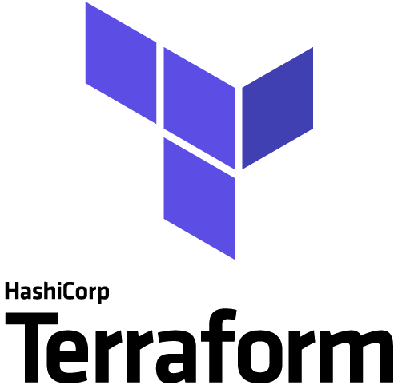

#   | build

The build part trigger the construction of objects that consume a lot of time, like the `docker images`.  
It also creates objects that are desired to persist between executions, like `docker volumes`.

## 1. Configuration

1. Go to terraform config dir for build (from this README folder)
   
```bash
cd env/terraform/build/
```

2. Initialize Terraform

```bash
terraform init
```

## 2. Deployment instructions

Execute the build.  

```bash
terraform apply
```

## 3. How to run tests

###  3.1. Check terraform objects

```bash
terraform state list
```

*Expected output similar to:*

```bash
docker_image.airflow_base
docker_image.airflow_celery
docker_image.postgres
docker_image.redis
docker_image.redisinsight
docker_volume.postgres-vol
```

###  3.2. Check docker images

```bash
docker image ls
```

*Expected output similar to:*

```bash
REPOSITORY               TAG               IMAGE ID       CREATED         SIZE
oak/airflow              2.2.2-celery      ad09e885cfa4   3 minutes ago   1.13GB
oak/airflow              latest            ad09e885cfa4   3 minutes ago   1.13GB
oak/airflow              2.2.2-base        bd4065bec9f1   4 minutes ago   1.13GB
oak/redis                6.2-nc            643e70acb26e   8 minutes ago   114MB
oak/redis                latest            643e70acb26e   8 minutes ago   114MB
postgres                 13.5              33f7fa4a9c0f   7 days ago      371MB
redis                    6.2               7614ae9453d1   7 days ago      113MB
python                   3.7-slim-buster   c2b8b72df8cd   7 days ago      113MB
redislabs/redisinsight   1.11.0            fca499a16526   2 months ago    1.27GB
```

###  3.3. Check docker volumes

```bash
docker volume ls
```

*Expected output similar to:*

```bash
DRIVER    VOLUME NAME
local     postgres-celery-vol
```

## 4. Undeploy instructions

### 4.1. Stop and remove docker containers and volumes

at `env/terraform/build/`  

```bash
terraform destroy
```

### 4.2. Remove docker images

```bash
docker image rm oak/airflow:latest python:3.7-slim-buster
docker image rm oak/redis:latest redis:6.2
```
